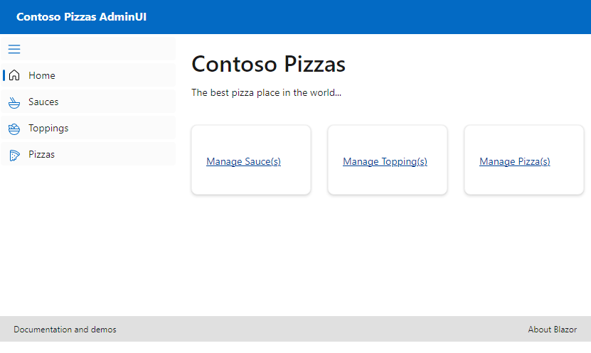
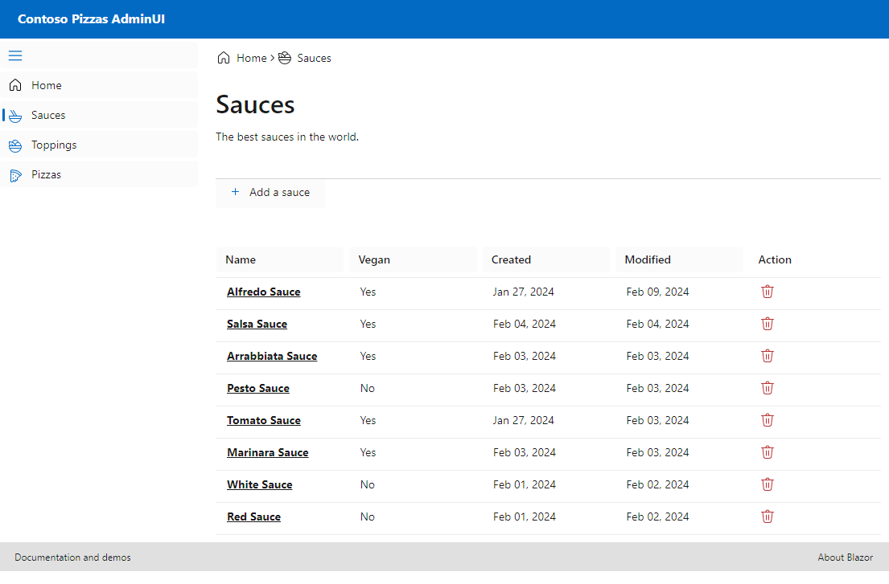
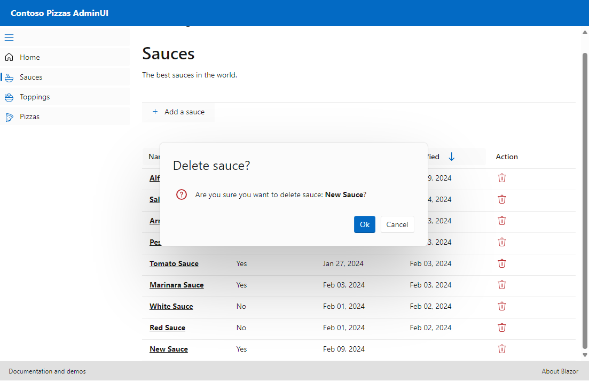

# Blazor + AspNet Web API + EFCore Sample

This application is a demo source code that showcases a [Blazor Server Web App](https://blazor.net) with Fluent UI Library. The backend API is built using ASP.NET Core Web API with Entity Framework Core. 

The [Blazor](https://blazor.net) Server Web App allows for building interactive web applications using C# instead of JavaScript. The [Fluent UI](fluentui-blazor.net) Library provides a set of reusable UI components that can be easily customized and integrated into the application.

The [ASP.NET Core](https://dotnet.microsoft.com/en-us/apps/aspnet) Web API serves as the backend for the application, providing data and functionality to the Blazor frontend. It is built using the powerful and flexible ASP.NET Core framework, allowing for easy integration with other services and databases.

[Entity Framework Core](https://learn.microsoft.com/en-us/ef/core/) is used as the ORM (Object-Relational Mapping) tool to interact with the database. It provides a convenient way to define and work with database entities, making it easier to perform CRUD operations and manage data.

This sample application serves as a starting point for developers who want to explore and learn about building Blazor Server Web Apps with Fluent UI and ASP.NET Core Web API with Entity Framework Core. Feel free to explore the code and customize it to fit your own requirements.

## Usage

To use this sample application, follow these steps:

1. Clone the repository.
2. Open the solution in Visual Studio or your preferred IDE.
3. Set up API project:
    - Under `src/Backend/Contoso.Pizza.AdminAPI.MVC`, update the database connection string in the `appsettings.json` file to point to your desired database.
    ```
    "ConnectionStrings": {
        "ContosoPizza": "<add your connection string>"
    }
    ```
    - Build the solution to restore NuGet packages and compile the code.
    - Run the database migrations to create the necessary tables and seed initial data.
    - Start the application `src/Backend/Contoso.Pizza.AdminAPI.MVC`. This is a ASP.NET MVC Core Web API project. It will open up a swagger page where you can test the API endpoints.
4. Set up Blazor project:
    - Under `src/Frontend/Contoso.Pizza.AdminUI`, build the solution to restore NuGet packages and compile the code.
    - Make sure to update the API Url in appsettings.json file to point to the API project.
    ```
    "Api": {
        "Url": "https://localhost:7110"
    }
    ```
    - Start the application `src/Frontend/Contoso.Pizza.AdminUI`. This is a Blazor Server Web App project. It will open up a web page where you can interact with the application.


## Screenshots
Home Page



Sauce Listing



Sauce Upsert


Sauce Delete



Other entity UI are similar to the Sauce UI. 